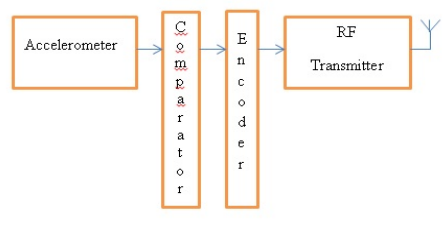

# Controlling-Robot-Using-Accelerometer   

The objective of this project is to build a accelerometer (ADXL335) based Gesture controlled Robot with ATmega16 microcontroller. Here, the ADXL335 accelerometer sensor act as the input device which is mounted on the hand, ATmega16 microcontroller act as the processing unit, DC Motor Driver act as the driver for the motors connected to the Robot, and RF link acts as a channel for wireless communication. The ATmega16 microcontroller reads the analog output values(x and y-axis values of the accelerometer, z-axis value left, as it is not needed in this project) of the ADXL335 accelerometer sensor and converts that analog values to digital values with its analog to digital converter. Then, the digital values are processed by the ATmega16 microcontroller and according to the tilt of the accelerometer sensor mounted on hand, the ATmega16 microcontroller then sends the command to RF transmitter which is Received by the transmitter and is processed by the other MCU at receiver side which drives the motors in forward, reverse, left, right direction and stops it. The Robot moves in forward, reverse, left, right direction and stops when the hand tilts in forward, backward, left, right direction and not tilted respectively. The direction of the Robot changes if the connection of motors to the DC Motor Driver and the accelerometer sensor direction of mounting are changed.  

## Schematic Diagram   

### Reciever module   

  

### Transmitter module   

  

## Prototype   

  

## Url

- https://ieeexplore.ieee.org/document/8269666  

### Contributors

- Aman Budhraja, Akshit Sharma, Shantanu Malhotra, Saurabh Deswal
